# Glow Mermaid Playground

Glow draws ` ```mermaid ` blocks as diagrams, sized to the terminal width.
Flowcharts (including cyclic ones), sequence, state, class, ER, gantt, pie,
mindmap, timeline, journey, quadrant, xychart and gitGraph diagrams are
rendered; the rare remainder falls back to the source. The icons in the
labels are [Nerd Font][nf] glyphs and need a Nerd Font-patched terminal
font to show up.

[nf]: https://www.nerdfonts.com

## CI pipeline

Top-down flowchart, dotted smoke tests, a thick fast lane, spaced edge
labels, a decision diamond and a dashed retry loop:

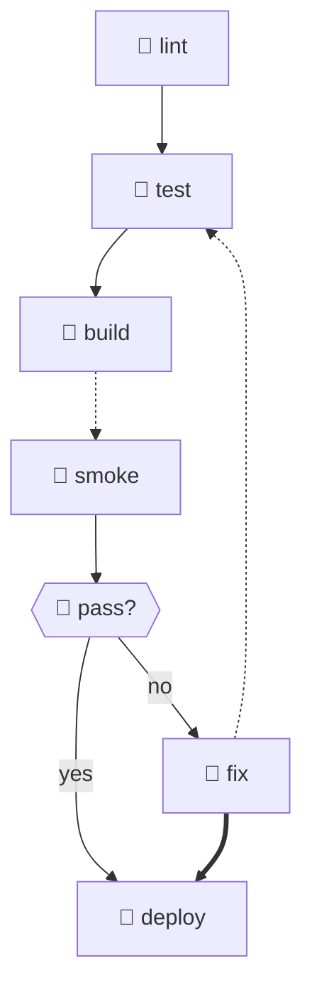

## Service architecture

Left-to-right flowchart with every shape, fanning out to workers and back
into the store:

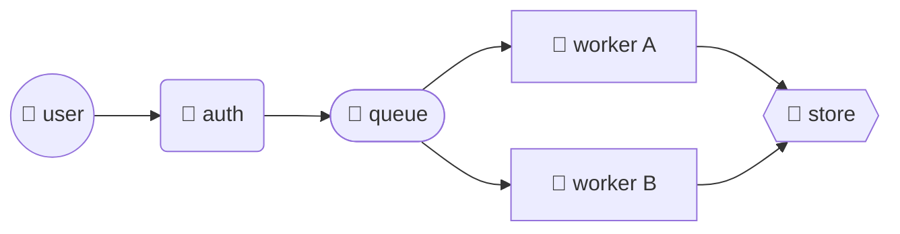

## Sequence diagram

Participants, solid and dashed messages, every arrowhead style, notes and
a loop frame:

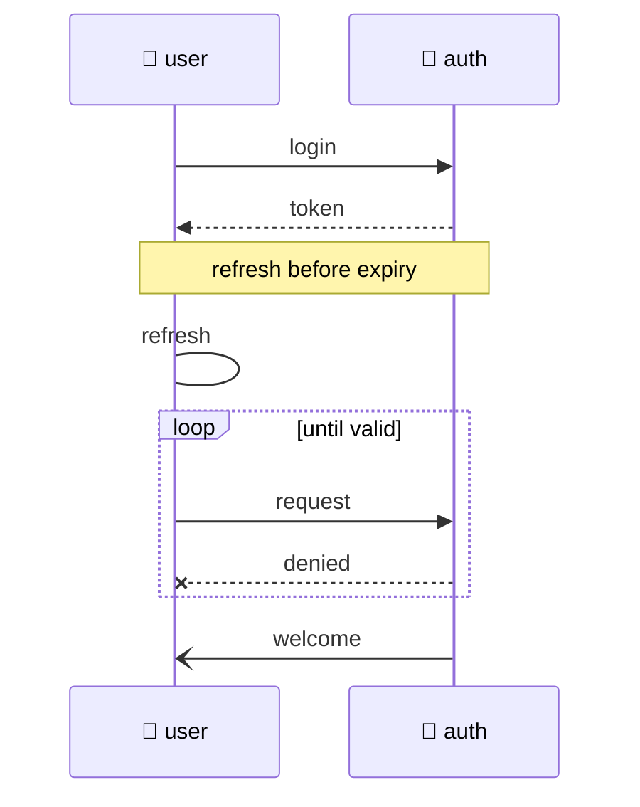

## State machine

Start and end markers, aliased states and transitions:

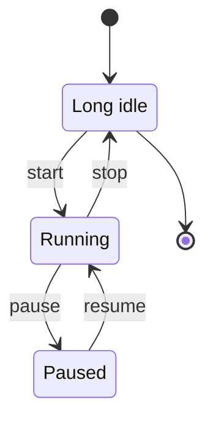

## Class diagram

Members, stereotypes, inheritance, realization and aggregation:

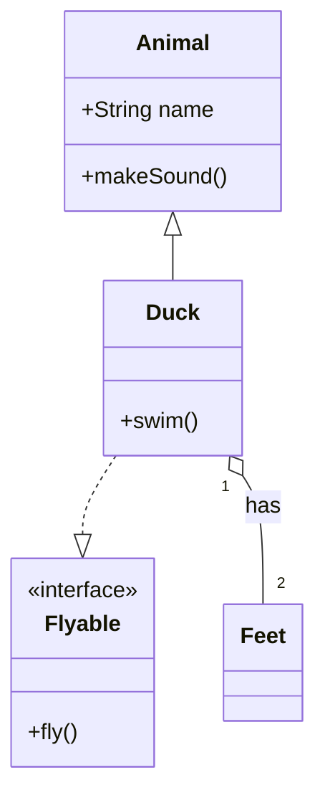

## ER diagram

Entities with attributes and labelled relationships:

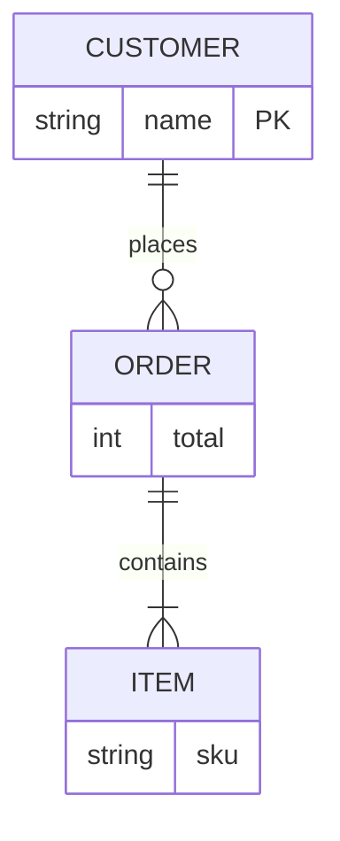

## Gantt chart

Sections, task flags and a milestone on a scaled time axis:

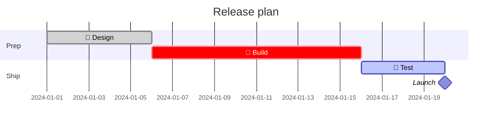

## Pie chart

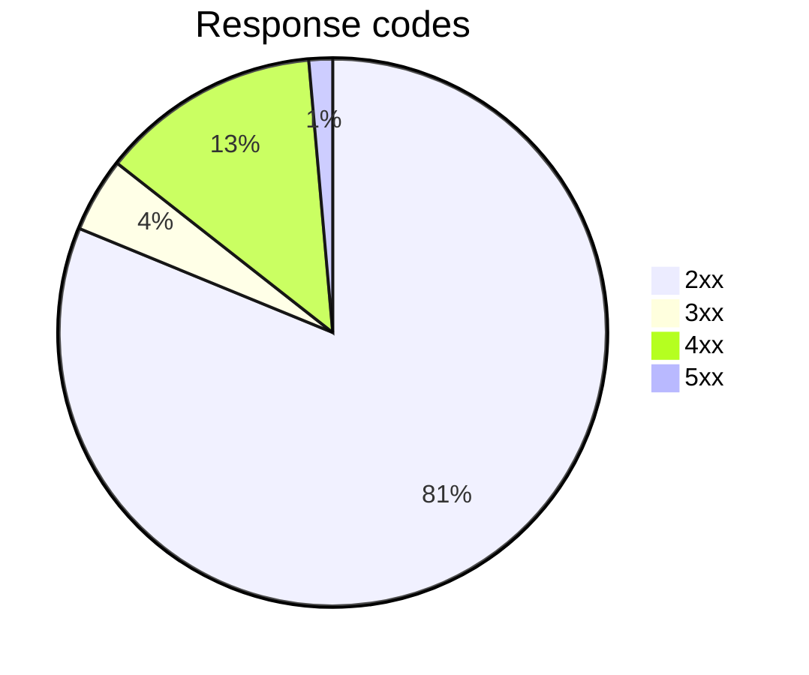

## Mindmap

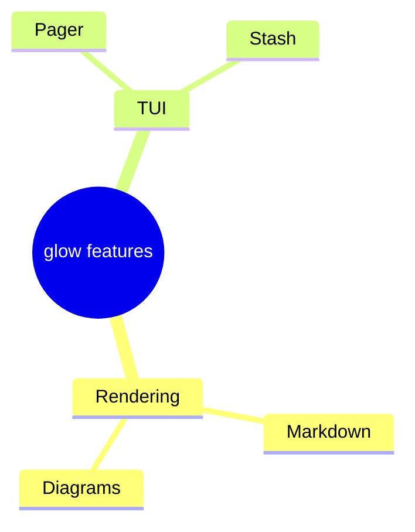

## Timeline

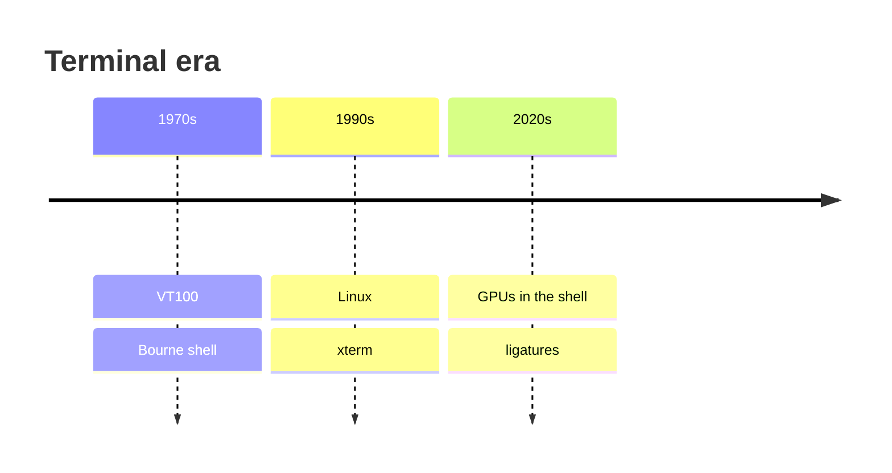

## Journey

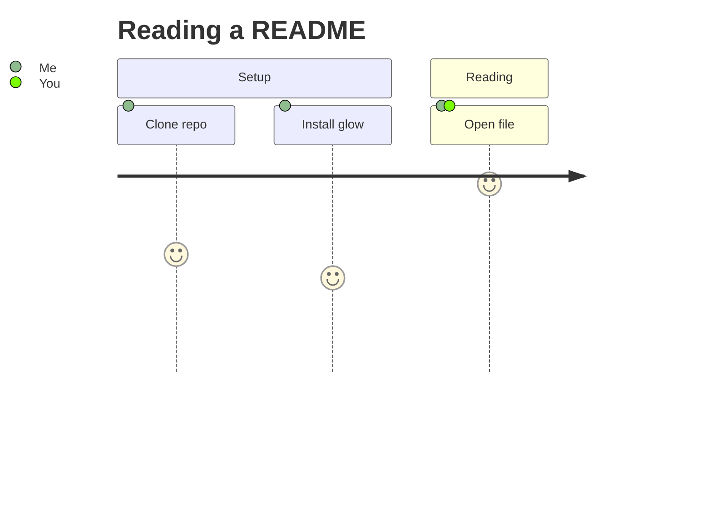

## Quadrant chart

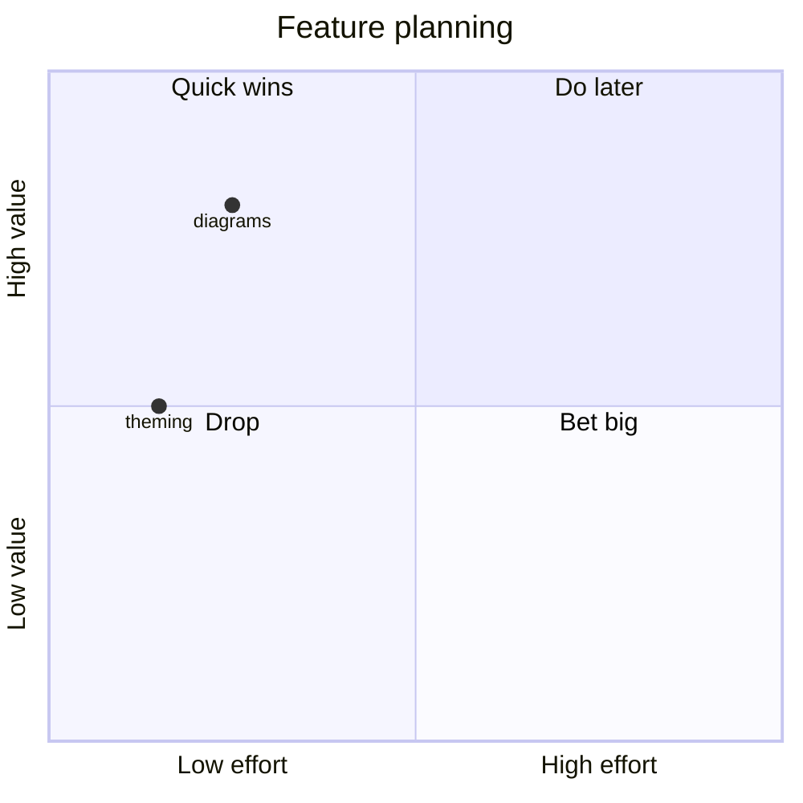

## XY chart

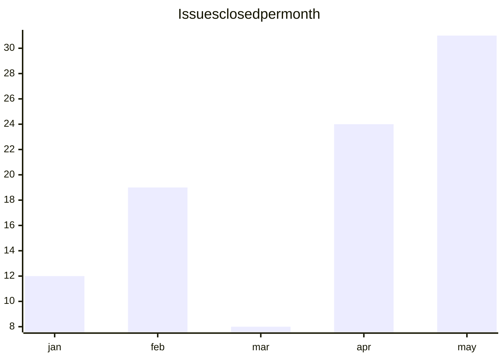

## Git graph

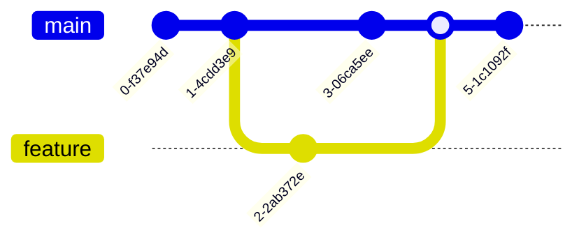

## Error handling

A deeper flowchart tree with an early exit:

```mermaid
flowchart TD
    R[" request"] --> V[" validate"]
    V --> E{{" format<br/>error?"}}
    E -- yes --> H[" 400 bad request"]
    E -- no --> X[" execute"]
    X --> O({{" 500?"}})
    O -- no --> K[" 200 ok"]
    O -- retry --> R2[" retry 3"]
    R2 --> H2[" 503 give up"]
```

## Unsupported diagrams

The rare remainder, like C4 diagrams, sankeys and packet charts, degrade
to the source plus a note explaining why:

```mermaid
C4Context
    person(user, User)
```
