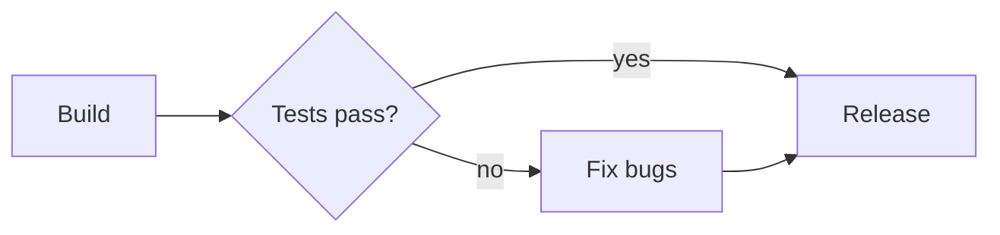
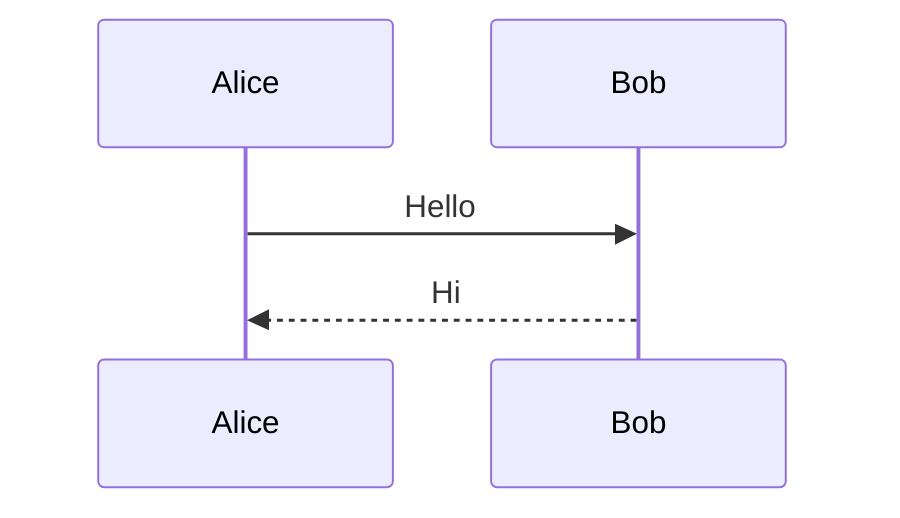

# Mermaid demo

Some prose before.

```mermaid
flowchart LR
    A[Build] --> B{Tests pass?}
    B -->|yes| C[Release]
    B -->|no| D[Fix bugs]
    D --> C
```

An unsupported one:

```mermaid
sequenceDiagram
    Alice->>Bob: Hello
    Bob-->>Alice: Hi
```
